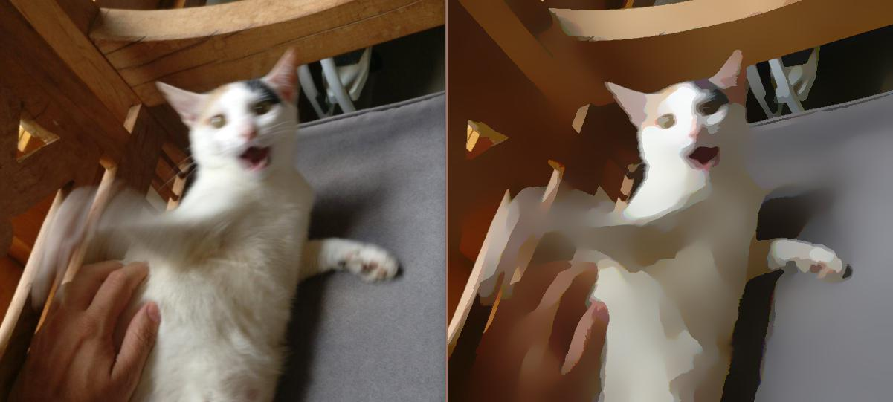
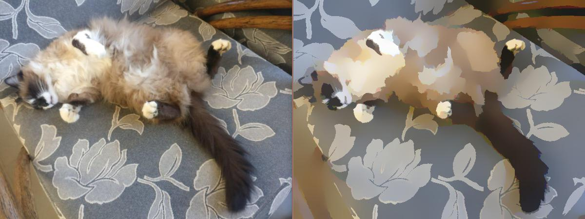
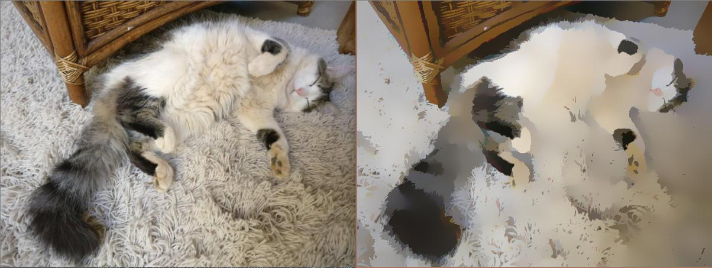
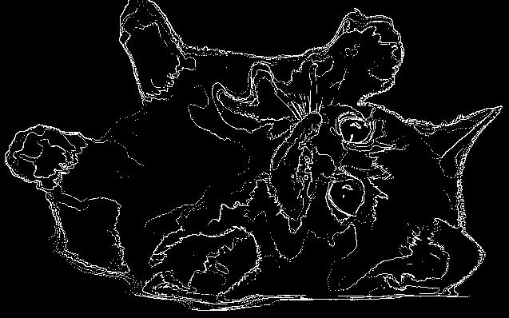

# Partial Report
We're attempting to reproduce the effect that toon shaders produce on 3D models but on 2D images instead, more specifically on cute pictures of cats. Because why the heck not, right? The internet is full of them! A marvelous sample size!

## Filters and Techniques Used
* Bilateral Filtering
* 2D Convolution for Edge Detection

## Libraries/Packages Used
* Python
* Numpy
* MatPlotlib (for visualization)
* OpenCV

## Explanation
  Whilst searching for ways to get the result we wanted, we found references to several filters and techniques we could use, such as: Box blur filtering, Color image segmentation, Edge detection and more.
  At first we were thinking of segmenting the image by region growing and then coloring these regions with either the average or median of the colors in that region.
  Then, we thought of getting the hsv color space of the image and setting dynamic color thresholds or buckets to merge all similar colors into one, a histogram based filter.
  However, upon further research we came to the conclusion that the Bilateral Filtering method would be perfect for what we're trying to achieve, since it retains the edges while averaging the rest. It's generally used to remove noise, but if we turn it up to 11 it might as well give us the cartoonish feel we want!

Our first sample image:

Awn. How Cute.

So, first we'll apply the bilateral filter a couple of times, let's start wih 5, and with a kernel size of 9.

NumOfDownSamplings: 1
NumOfBilateralFilterings: 5
KernelSize: 9

Well won't you look at that! We're going places!
But it's not quite there yet, it's still too subtle and not cartoonish enough, but it seems like it'll work.
Now let's try to apply the filter even more times, let's say... 15.

NumOfBilateralFilterings: 15
KernelSize: 9

Erm... that didn't really change anything.
Let's try changing the kernel size instead. What about 20?

NumOfBilateralFilterings: 7
KernelSize: 20

Nope. Not a lot changed, once again. What to do...
After some meddling and more research, we found out that perhaps applying the filter to each of the color channels (Red, Green and Blue) may generate better results. Let's try that.

NumOfBilateralFilterings: 7
KernelSize: 20
AppliedToEachChannel: true

There we go! Perfect! That's what we want!
Now let's do it to Moacir's cats!

Adorable! Success!

We algo tried to do some edge detection to add an option to add outlines to the resulting images, but we're not yet satisfied with the results. We used an edge detection convolution with the kernel [-1, -1, -1] [-1, 8, -1] [-1, -1, -1] for each color, which gave us this:

Then applied a threshold:

Well, it's interesting but still needs some more meddling to work the way we want, then we need to actually color that outline and apply it to the image. The problem is that it still detects too much of the fur and details.

We want to work on that edge detection and perhaps also as a bonus use openCV's image detection to detect whether or not it is a cat! But for the partial report, that's it!
