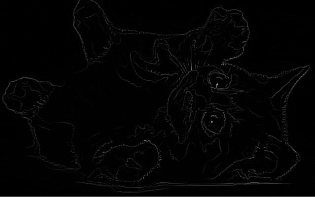
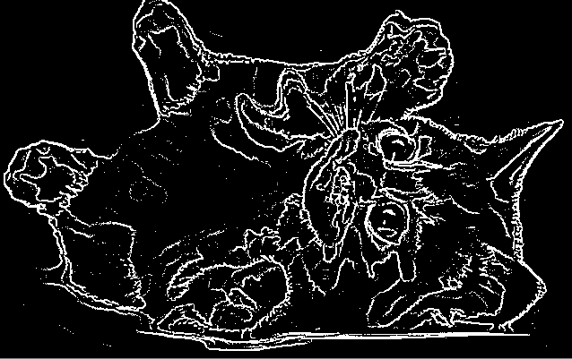
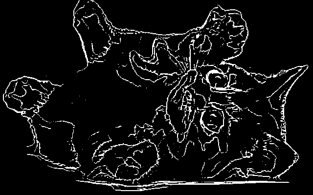
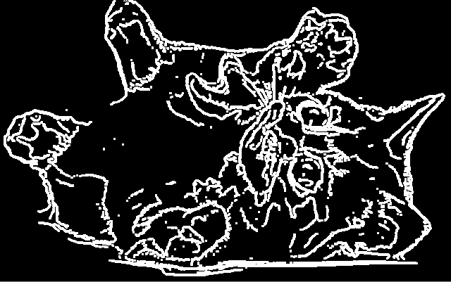
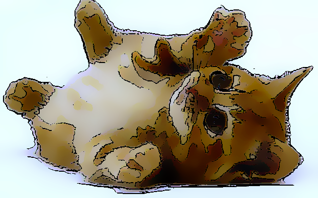
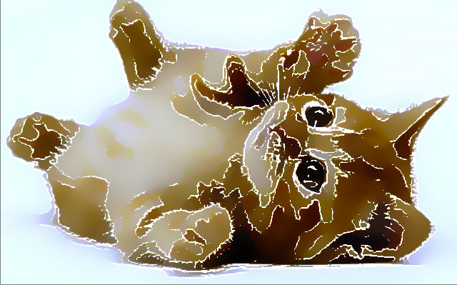
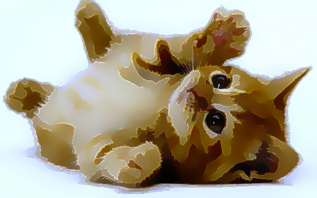

# CartoonFilter
Filter that attempts to, given a photo or any other image, to "cartoonize" the image, similar to what toon and outline shaders do with 3D models, but applied to 2D.

# CartoonFilter
Filter that attempts to, given a photo or any other image, to "cartoonize" the image, similar to what toon and outline shaders do with 3D models, but applied to 2D.

# Final Report
We were able to reproduce the effect that toon shaders produce on 3D models but on 2D images instead, more specifically on cute pictures of cats and also furniture, which wasn't intially planned but worked out really great!

## Filters and Techniques Used
* Bilateral Filtering
* 2D Convolution with Laplacian Operator for Edge Detection
* Morphological Image Processing: Erosion and Dilation

## Libraries/Packages Used
* Python
* Numpy
* OpenCV

## Explanation
  Whilst searching for ways to get the result we wanted, we found references to several filters and techniques we could use, such as: Box blur filtering, Color image segmentation, Edge detection and more.
  At first we were thinking of segmenting the image by region growing and then coloring these regions with either the average or median of the colors in that region.
  Then, we thought of getting the hsv color space of the image and setting dynamic color thresholds or buckets to merge all similar colors into one, a histogram based filter.
  However, upon further research we came to the conclusion that the Bilateral Filtering method would be perfect for what we're trying to achieve, since it retains the edges while averaging the rest. It's generally used to remove noise, but if we turn it up to 11 it might as well give us the cartoonish feel we want!

<!-- Aqui colocam a explicacao do bilateral 
    Implementacao do nosso bilateral
    Comparar com o bilateral do opencv
    Aumento da saturacao
    Downsampling
    Mostra com mobília tambem
-->

We also decided to do some edge detection to create outlines for the images, but it would be optional to the user.
We start with a convolution with the Laplacian Operator ((-1, -1, -1), (-1, 8, -1), (-1, -1, -1)) as the kernel for the grayscale version of the cartoon image

Then applied a threshold:

As we can see, there is still a lot of noise and it gets a lot of details we don't want.
To solve that, we decided to add some morphological operations to the edges. More especifically, an erosion.
After some testing we ended up using a circle-like mask/kernel of size 3 ((0, 1, 0), (1, 1, 1), (0, 1, 0)) for the erosion and apply it only once, which led to great results:

Great! A lot of the noise and unwanted details are gone.
We thought of then dilating to complete an opening operation, but we results weren't so great:

We ended up not leaving it because the results were better without it. We also tried other possibilities, such as: 2 erosions, 1 dilation, 1 dilation 2 erosions, 2 erosions 2 dilations, and even applying a gaussian blur after the erosion, but overall, the best results were just to erode once.

Now we have to apply those edges to the image. Previously we would just add them in in white, because adding them in black led to highlights being lost, such as on the cat's eyes:

Yikes. Nope.

Then we decided for a while to leave the outlines white:

Which is better, but still not optimal.
So we tried a different approach: In drawings, the outlines aren't always black or white, generally they are just a darker/brighter, more saturated version of the color in that area. So, we decided that if the brightness of a pixel in the outline is high, we decrease it by 20%, or else if it's low, we increase it by 20%:

Not too shabby! It's not what we wanted to achieve initially but it does a great job of making a good looking outline whilst sharpening the edges as well.
